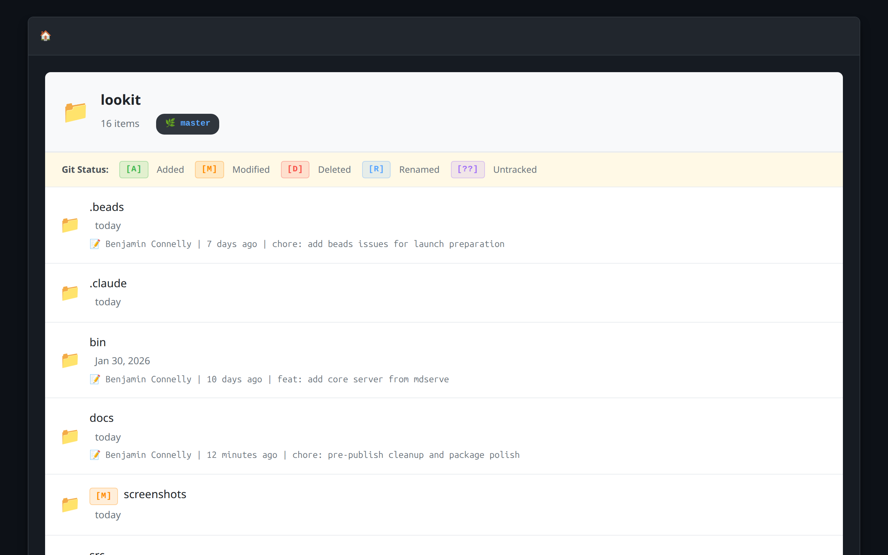
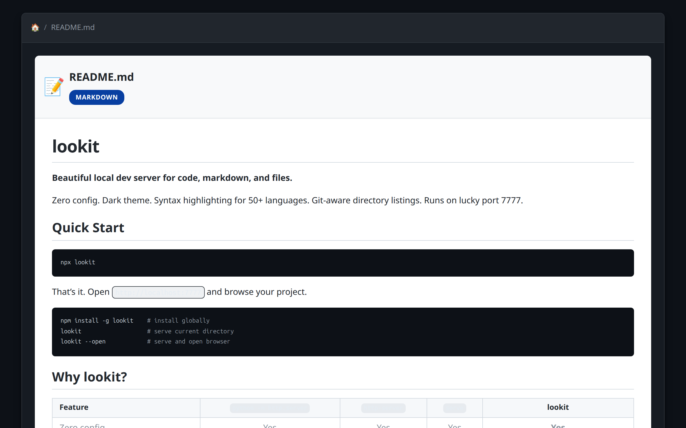
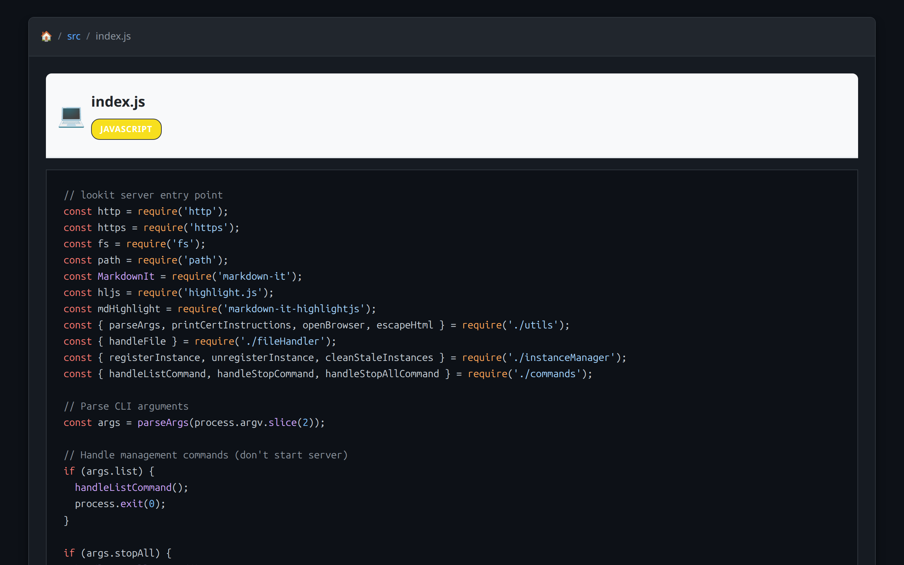
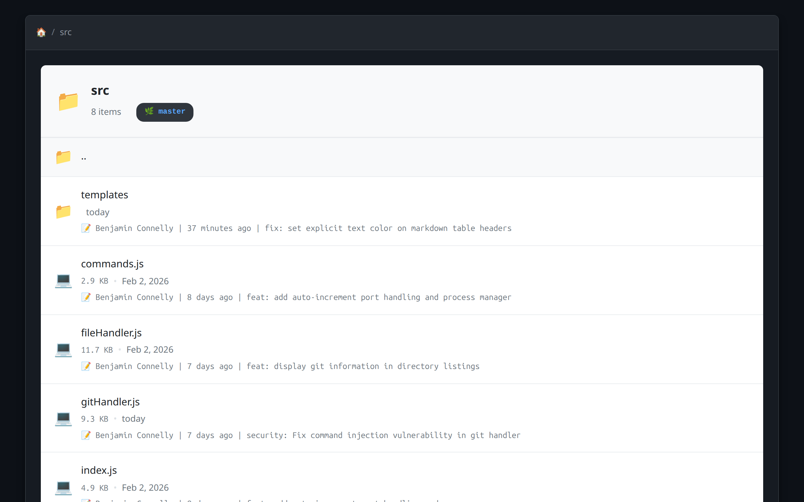

# lookit

**Beautiful local dev server for code, markdown, and files.**

<!-- Badges: uncomment when published
[](https://www.npmjs.com/package/lookit)
[](https://www.npmjs.com/package/lookit)
[](LICENSE)
-->

Zero config. Dark theme. Syntax highlighting for 50+ languages. Git-aware directory listings. Runs on lucky port 7777.



## Quick Start

```bash
npx lookit
```

That's it. Open `http://localhost:7777` and browse your project.

```bash
npm install -g lookit    # install globally
lookit                   # serve current directory
lookit --open            # serve and open browser
```

## Why lookit?

| Feature | `python -m http.server` | `http-server` | `serve` | **lookit** |
|---------|:-----------------------:|:-------------:|:-------:|:----------:|
| Zero config | Yes | Yes | Yes | **Yes** |
| Syntax highlighting | No | No | No | **50+ languages** |
| Markdown rendering | No | No | No | **GitHub-style** |
| Dark theme | No | No | No | **Built-in** |
| Git status badges | No | No | No | **Per-file** |
| .gitignore aware | No | No | No | **Yes** |
| Multi-instance | No | No | No | **Auto port increment** |
| HTTPS (local certs) | No | Optional | No | **Built-in** |
| File type icons | No | No | No | **50+ types** |

## Features

### Markdown Rendering

GitHub-style rendering with syntax-highlighted code blocks, tables, task lists, and clean typography.



### Code Viewing

Syntax highlighting for 50+ languages. Auto-detects from file extension. Language badges with color coding.



### Git-Aware Directory Listings

See git status at a glance. Modified, staged, untracked - each file shows its git state. Current branch in the header. Per-file commit info on hover.



### Multi-Instance Management

Run lookit in multiple projects at once. Ports auto-increment from 7777.

```bash
cd ~/project-a && lookit &   # 7777
cd ~/project-b && lookit &   # 7778
cd ~/project-c && lookit &   # 7779

lookit --list                # see all instances
lookit --stop 7778           # stop one
lookit --stop-all            # stop all
```

### HTTPS Out of the Box

Drop in mkcert certificates and lookit serves over HTTPS automatically. No flags needed.

```bash
mkcert -install
mkdir -p ~/.config/lookit
mkcert -cert-file ~/.config/lookit/localhost.pem \
       -key-file ~/.config/lookit/localhost-key.pem \
       localhost 127.0.0.1 ::1
```

## File Support

| Type | What You Get |
|------|-------------|
| **Markdown** `.md` `.mdx` | Rendered HTML with syntax-highlighted code blocks |
| **Code** `.js` `.ts` `.py` `.go` `.rs` + 45 more | Syntax highlighting with language badges |
| **Images** `.png` `.jpg` `.gif` `.svg` `.webp` | Native browser display |
| **Video** `.mp4` `.webm` `.mov` | Native browser playback |
| **Audio** `.mp3` `.wav` `.ogg` `.flac` | Native browser playback |
| **PDF** `.pdf` | Native browser viewer |
| **Binary** everything else | Preview card with download |

## Options

```
lookit [OPTIONS]

--port <number>      Port (default: 7777)
--host <address>     Host (default: 127.0.0.1)
--open               Open browser on start
--all                Show .gitignore'd files
--no-https           Force HTTP
--https-only         Require HTTPS
--no-dirlist         Disable directory listings
--cert <path>        Custom TLS certificate
--key <path>         Custom TLS private key
-l, --list           List running instances
--stop <port>        Stop instance by port
--stop-all           Stop all instances
-v, --version        Show version
-h, --help           Show help
```

## Security

- Path traversal protection - no access outside served directory
- Binary files show preview cards, never execute
- Read-only access to all files
- HTTPS with locally-trusted certificates

## Development

```bash
git clone https://github.com/Benjamin-Connelly/lookit.git
cd lookit && npm install
node bin/lookit.js
```

## Contributing

Contributions welcome. Open an issue or submit a PR.

## License

MIT © Benjamin Connelly

---

**Start browsing:** `npx lookit`
