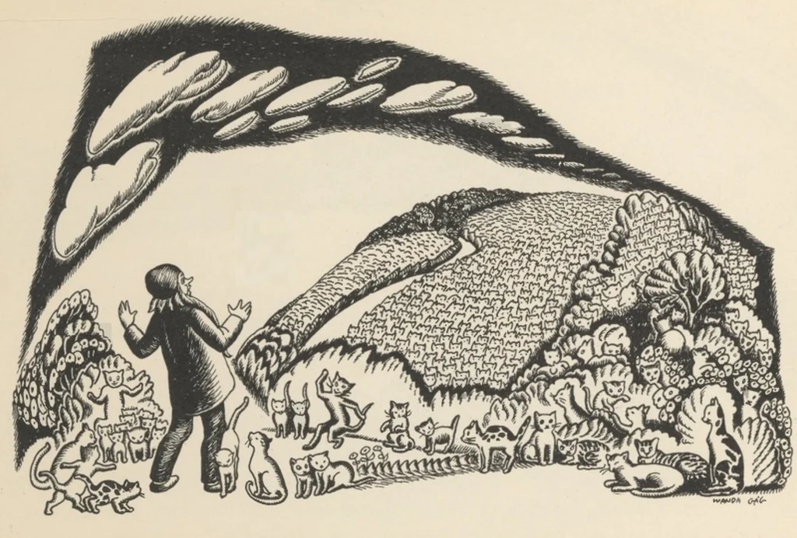
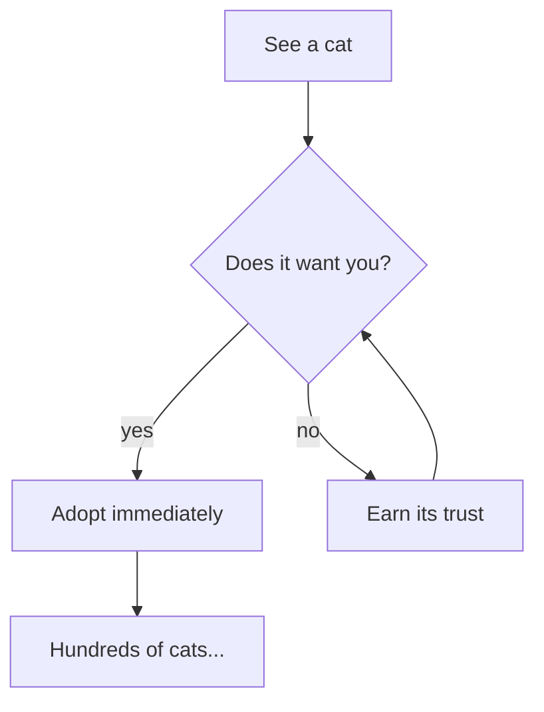

# A Field Guide to Cats

Everything `fur` can render, told through **cats** — *the* most important
subject in computing. This page is the kitchen sink: headings, tables, code,
task lists, a diagram, an illustration, and links you can follow with the
keyboard.

> Cats here, cats there,
> Hundreds of cats, thousands of cats,
> millions and billions and trillions of cats.
> — Wanda Gág, [*Millions of Cats*](millions-of-cats/millions-of-cats.md)



## Contents at a glance

- [Anatomy](#anatomy) — the parts of a cat
- [Behavior](#behavior) — what cats do, and why
- [Care checklist](#care-checklist) — your daily duties
- [Talking to cats](#talking-to-cats) — hello in four languages
- The full story lives in [[millions-of-cats]]; breeds in [[breeds]]

---

## Anatomy

A cat is mostly **fur**, a little *mischief*, and ~~no~~ infinite patience for
your keyboard. Selected specifications:

| Part      | Count | Notes                                |
|-----------|------:|--------------------------------------|
| Whiskers  |    24 | width sensors — do not trim          |
| Toes      |    18 | 5 front, 4 back (polydactyls vary)   |
| Lives     |     9 | non-transferable                     |
| Naps/day  |    16 | minimum; more when it rains          |

A cat is `O(1)` to love and `O(n!)` to herd.

## Behavior

1. Knock the thing off the table.
2. Observe the thing on the floor.
3. Demand a new thing.
   - This is *the loop*.
   - It does not terminate.

For breed-specific chaos levels, see [[breeds]].

## Care checklist

Tasks are extracted by `fur tasks` — note the `!priority`, `#tag`, and
`@due(...)` annotations:

- [x] Fresh water !high #daily
- [x] Two square meals #daily @due(2026-07-01)
- [ ] Brush the fur !medium #weekly
- [ ] Trim the claws !low #monthly @due(2026-07-15)
- [ ] Apologize for the vet visit #asneeded

## Talking to cats

Every fenced block is syntax-highlighted (50+ languages):

```go
package main

import "fmt"

func main() {
	for i := 0; i < 9; i++ { // nine lives
		fmt.Println("meow")
	}
}
```

```python
def greet(cat: str) -> str:
    return f"meow, {cat}"
```

```bash
# Adopt responsibly
fur serve ~/cats --open
```

```json
{
  "name": "Whiskers",
  "lives": 9,
  "naps_per_day": 16,
  "favorite_spot": "your keyboard"
}
```

## Should you adopt a cat?

In web mode this Mermaid block renders as a diagram; in the TUI it stays
highlighted source:



---

## See also

- The original tale: [Millions of Cats](millions-of-cats/millions-of-cats.md)
- A page that does not exist yet: [the rare hairless wonder](sphynx.md)
- Jump back up to [Anatomy](#anatomy)

*Rendered with fur — try `fur cat cat-field-guide.md`.*
