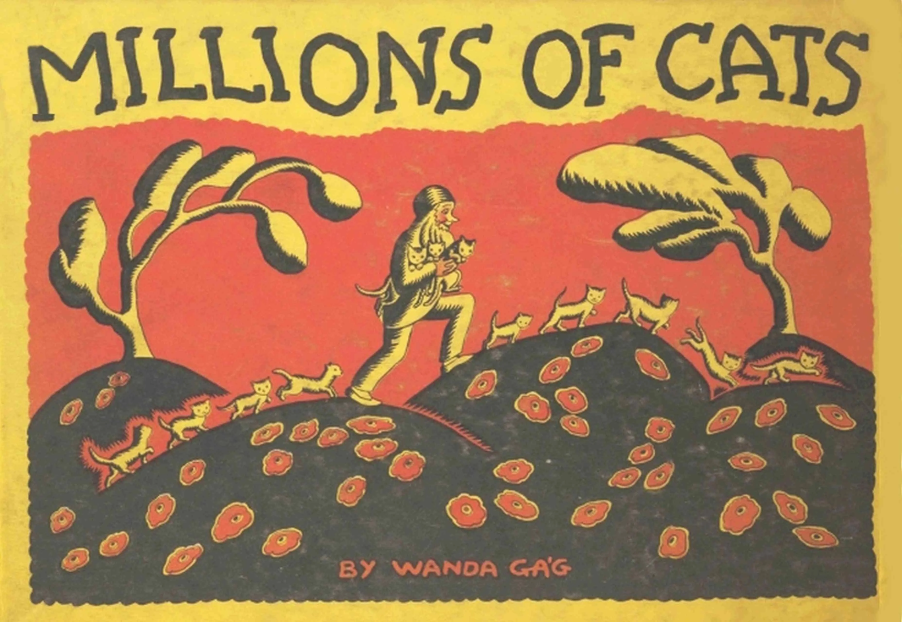
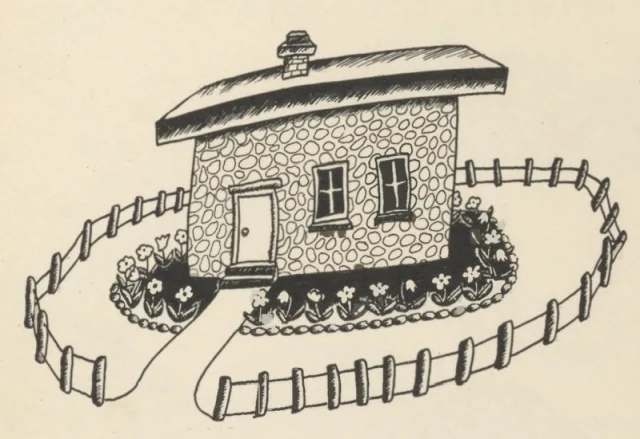
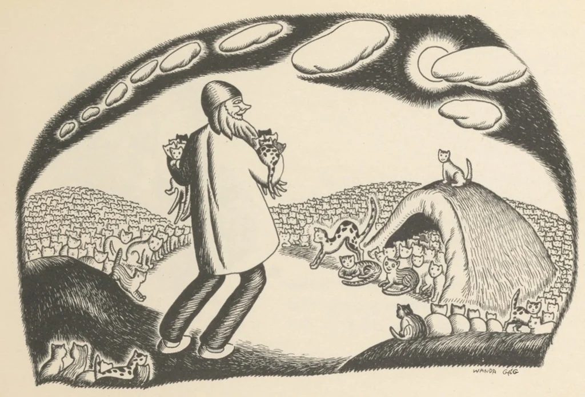
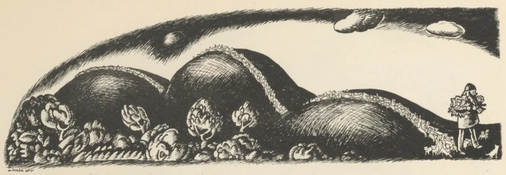
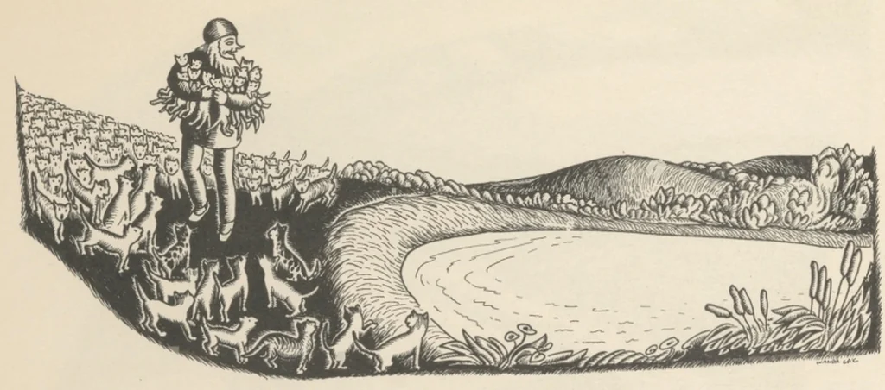
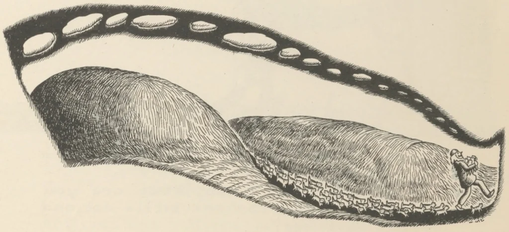
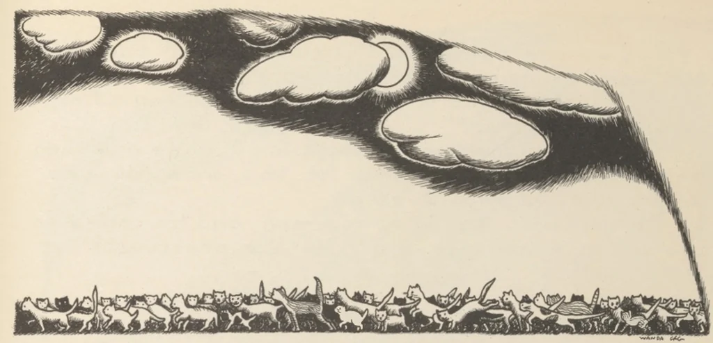
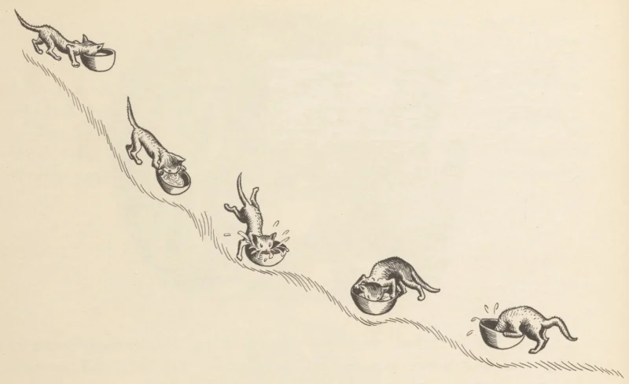
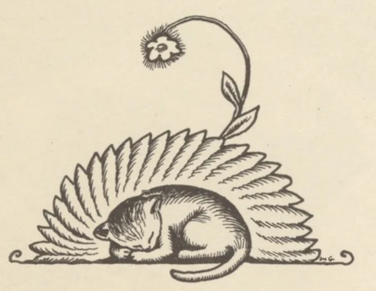

# Millions of Cats

*by Wanda Gág* — published 1928, now in the public domain.

---

Once upon a time there was a very old man and a very old woman. They lived in a
nice clean house which had flowers all around it, except where the door was. But
they couldn't be happy because they were so very lonely.

"If we only had a cat!" sighed the very old woman.

"A cat?" asked the very old man.

"Yes, a sweet little fluffy cat," said the very old woman.

"I will get you a cat, my dear," said the very old man.

And he set out over the hills to look for one. He climbed over the sunny hills.
He trudged through the cool valleys. He walked a long, long time and at last he
came to a hill which was quite covered with cats.

> Cats here, cats there,
> Cats and kittens everywhere,
> Hundreds of cats,
> Thousands of cats,
> Millions and billions and trillions of cats.

"Oh," cried the old man joyfully, "Now I can choose the prettiest cat and take it
home with me!" So he chose one. It was white.

But just as he was about to leave, he saw another one all black and white and it
seemed just as pretty as the first. So he took this one also.

But then he saw a fuzzy grey kitten way over here which was every bit as pretty as
the others so he took it too. And now he saw one way down in a corner which he
thought too lovely to leave so he took this too.

And now, over there, he saw a cat which had brown and yellow stripes like a baby
tiger. "I simply must take it!" cried the very old man, and he did.

So it happened that every time the very old man looked up, he saw another cat
which was so pretty he could not bear to leave it, and before he knew it, he had
chosen them all.

And so he went back over the sunny hills and down through the cool valleys, to
show all his pretty kittens to the very old woman. It was very funny to see those
hundreds and thousands and millions and billions and trillions of cats following
him.

They came to a pond.

"Mew, mew! We are thirsty!" cried the Hundreds of cats, Thousands of cats,
Millions and billions and trillions of cats.

"Well, here is a great deal of water," said the very old man.

Each cat took a sip of water, and the pond was gone!

"Mew, mew! Now we are hungry!" said the Hundreds of cats, Thousands of cats,
Millions and billions and trillions of cats.

"There is much grass on the hills," said the very old man.

Each cat ate a mouthful of grass and not a blade was left!

Pretty soon, the very old woman saw them coming.

"My dear!" she cried, "What are you doing? I asked for one little cat, and what do
I see?—

"But we can never feed them all," said the very old woman, "They will eat us out
of house and home."

"I never thought of that," said the very old man, "What shall we do?"

The very old woman thought for a while and then she said, "I know! We will let the
cats decide which one we should keep." And the very old man called to the cats,
"Which one of you is the prettiest?"

"I am!" "I am!" "No, I am!" "No, I am the prettiest!" "I am!" — cried hundreds and
thousands and millions and billions and trillions of voices, for each cat thought
itself the prettiest.

And they began to quarrel. They bit and scratched and clawed each other and made
such a great noise that the very old man and the very old woman ran into the house
as fast as they could. But after a while the noise stopped, and when they peeped
out of the window they could not see a single cat!

"But look!" said the very old man, and he pointed to a bunch of high grass. In it
sat one little frightened kitten. It was thin and scraggly.

"Dear little kitty," said the very old man, "how does it happen that you were not
eaten up with all those hundreds and thousands and millions and billions and
trillions of cats?"

"Oh, I'm just a very homely little cat," said the kitten, "So when you asked who
was the prettiest, I didn't say anything. So nobody bothered about me."

They took the kitten into the house, where the very old woman gave it a warm bath
and brushed its fur until it was soft and shiny. Every day they gave it plenty of
milk—

—and soon it grew nice and plump.

"And it is a very pretty cat, after all!" said the very old woman.

"It is the most beautiful cat in the whole world," said the very old man. "I ought
to know, for I've seen—

> Hundreds of cats,
> Thousands of cats,
> Millions and billions and trillions of cats—
> and not one is as pretty as this one."

---

*"Millions of Cats" by Wanda Gág (1928) is in the public domain. Text and
illustrations sourced from [Project Gutenberg](https://www.gutenberg.org/ebooks/74181),
eBook #74181. Reproduced here as sample content for `fur`.*
