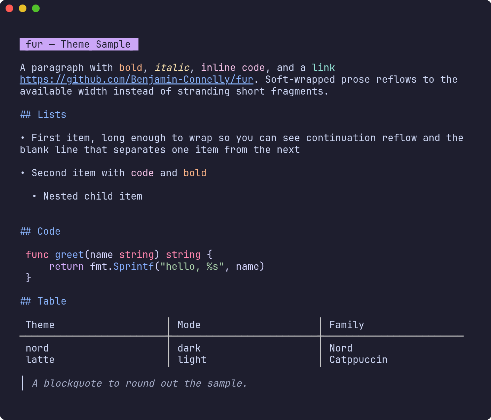
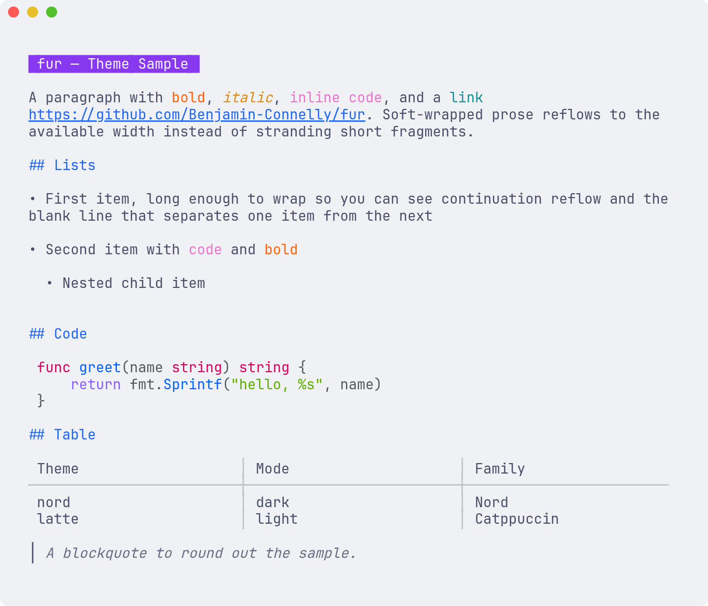
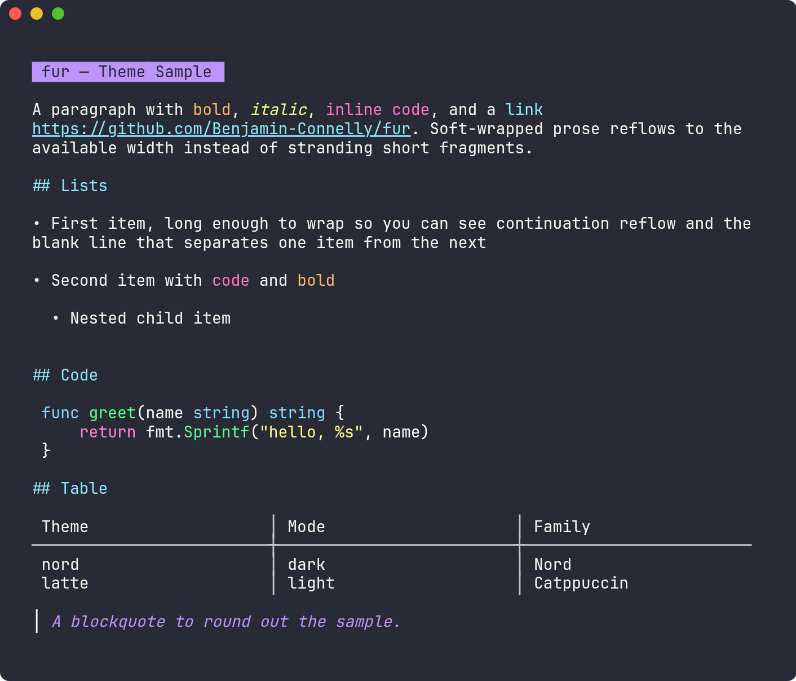
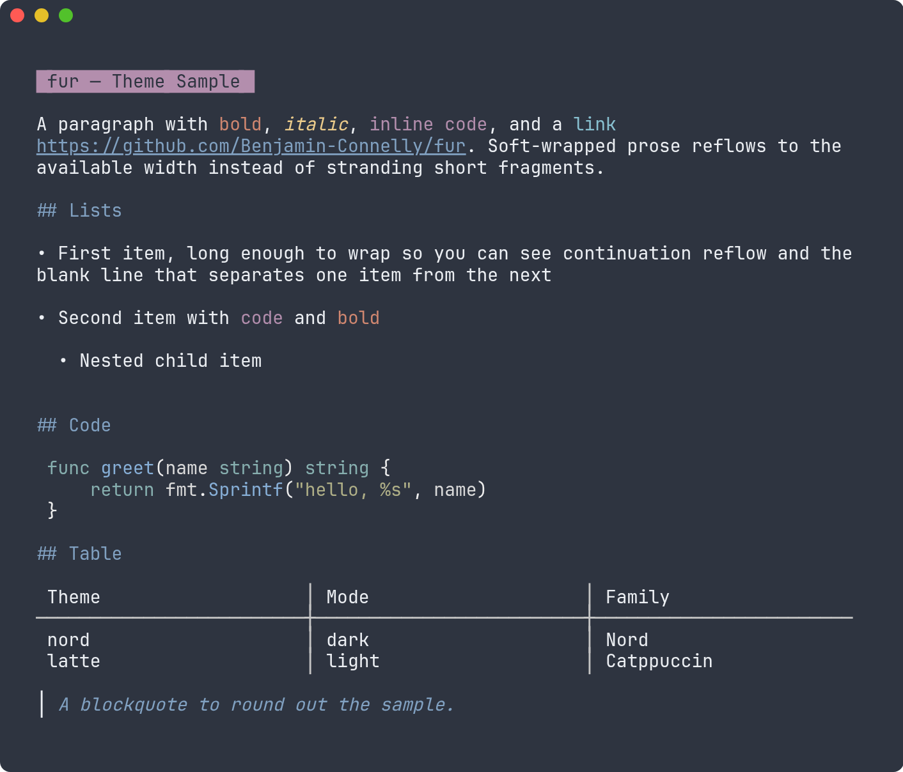
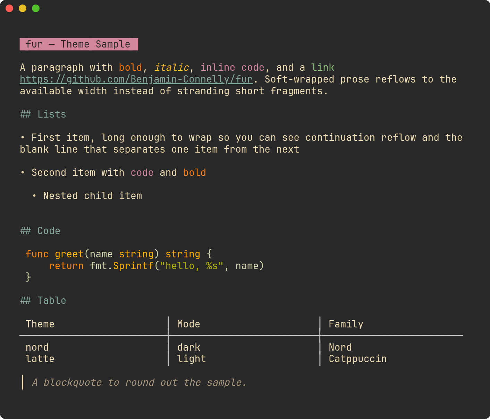
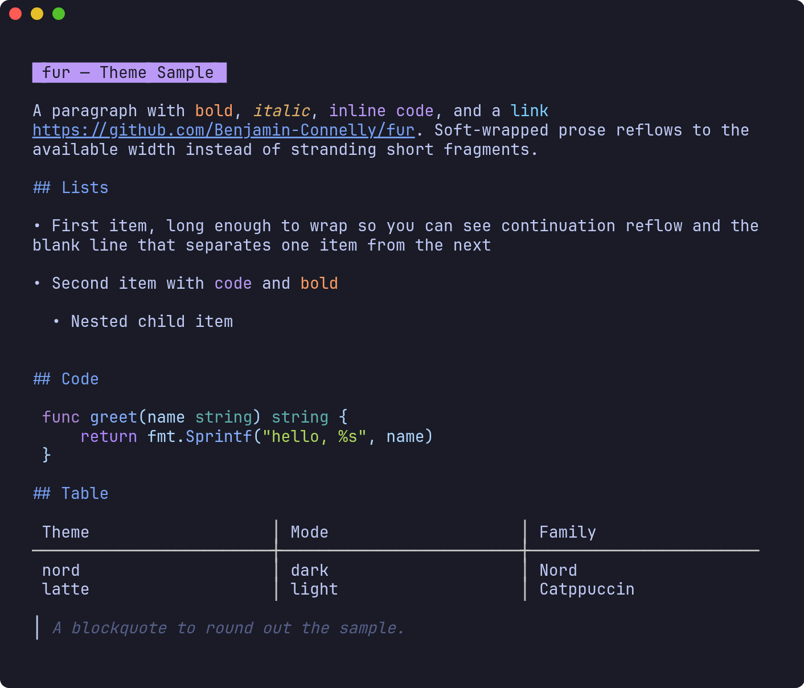

# Themes

`fur` ships 19 built-in themes. Each theme is a single palette that drives all
three rendering surfaces together, so the document body, fenced code, and the
surrounding UI always share one coherent color set:

- **Markdown body** — a [glamour](https://github.com/charmbracelet/glamour) style built from the palette
- **Code highlighting** — the matching [Chroma](https://github.com/alecthomas/chroma) style (standalone code files and fenced blocks)
- **TUI chrome** — [lipgloss](https://github.com/charmbracelet/lipgloss) colors for the status bar, file list, gutters, selection, and links

## Using themes

```bash
fur --theme catppuccin-mocha           # launch the TUI in a theme
fur cat --theme gruvbox file.md        # one-shot render in a theme
```

In the TUI:

- `ctrl+t` — cycle to the next theme
- `:theme <name>` — jump straight to a named theme

Or set a default in `~/.config/fur/config.yaml`:

```yaml
theme: nord
```

## Gallery

A curated selection, each rendering [`sample.md`](./sample.md). Light themes set
foreground colors only and assume a light terminal background; the shots below
use each theme's base color as the window background to show it as intended.

### catppuccin-mocha



### catppuccin-latte



### dracula



### nord



### gruvbox



### tokyonight-night



> Regenerate with [`generate.sh`](./generate.sh) (needs `fur`, [freeze](https://github.com/charmbracelet/freeze), and `google-chrome`).

## Available themes

| Name | Mode | Family |
|------|------|--------|
| `auto` | adapts | Neutral (detects terminal background) |
| `dark` | dark | Neutral default |
| `light` | light | Neutral default |
| `ascii` | none | No color (glamour `notty`) |
| `catppuccin-mocha` | dark | Catppuccin |
| `catppuccin-macchiato` | dark | Catppuccin |
| `catppuccin-frappe` | dark | Catppuccin |
| `catppuccin-latte` | light | Catppuccin |
| `gruvbox` | dark | Gruvbox |
| `gruvbox-light` | light | Gruvbox |
| `dracula` | dark | Dracula |
| `nord` | dark | Nord |
| `solarized-dark` | dark | Solarized |
| `solarized-light` | light | Solarized |
| `rose-pine` | dark | Rosé Pine |
| `rose-pine-moon` | dark | Rosé Pine |
| `rose-pine-dawn` | light | Rosé Pine |
| `tokyonight-night` | dark | TokyoNight |
| `tokyonight-storm` | dark | TokyoNight |
| `tokyonight-moon` | dark | TokyoNight |
| `tokyonight-day` | light | TokyoNight |

## Previewing

[`kitchen-sink.md`](./kitchen-sink.md) exercises every markdown construct fur
renders. Use it to preview any theme end to end:

```bash
fur cat --theme tokyonight-night docs/themes/kitchen-sink.md
fur docs/themes/kitchen-sink.md        # then press ctrl+t to flip themes
```
